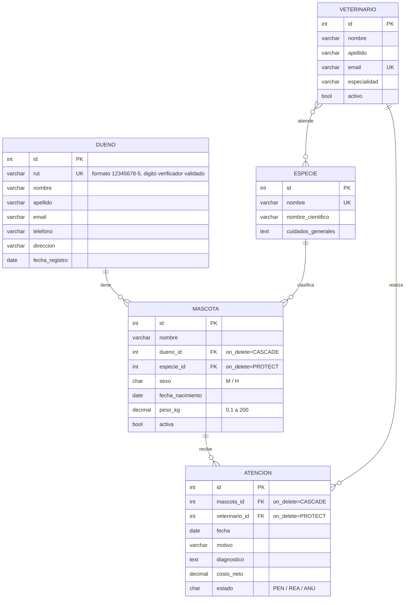

# Clínica Veterinaria Patitas

Aplicación web desarrollada con **Django 5.2** bajo el patrón **MVT**, para la
gestión de pacientes de una clínica veterinaria. El acceso está controlado por
autenticación y los datos se persisten en **PostgreSQL**.

> Asignatura: Desarrollo Web y Aplicaciones Móviles · Taller evaluado AE1–AE2

---

## 1. Descripción del dominio

La Clínica Veterinaria Patitas atiende mascotas de distintas especies. Cada
mascota pertenece a un **dueño** y corresponde a una **especie**. Cuando la
mascota asiste a la clínica se registra una **atención**, realizada por un
**veterinario**. Cada veterinario está habilitado solo para ciertas especies,
de modo que el sistema impide asignar una atención a un profesional que no
atiende esa especie.

### Entidades y relaciones

| Entidad | Descripción | Campos principales |
|---|---|---|
| `Especie` | Catálogo de especies atendidas | nombre, nombre_cientifico, cuidados_generales |
| `Dueno` | Persona responsable de las mascotas | rut, nombre, apellido, email, telefono, direccion |
| `Veterinario` | Profesional que realiza atenciones | nombre, apellido, email, especialidad, activo |
| `Mascota` | **Entidad principal**: el paciente | nombre, sexo, fecha_nacimiento, peso_kg, activa |
| `Atencion` | Consulta veterinaria | fecha, motivo, diagnostico, costo_neto, estado |

**Relaciones**

```
Dueno        1 ──────< N  Mascota          (ForeignKey)
Especie      1 ──────< N  Mascota          (ForeignKey)
Mascota      1 ──────< N  Atencion         (ForeignKey)
Veterinario  1 ──────< N  Atencion         (ForeignKey)
Veterinario  N >─────< N  Especie          (ManyToManyField: especies_atendidas)
```

- Relación 1:N obligatoria: `Mascota → Dueno`.
- Segunda relación: `Veterinario ↔ Especie` (**ManyToMany**), porque un
  veterinario atiende varias especies y una especie es atendida por varios
  veterinarios.

### Diagrama del modelo de datos



**Cardinalidades**

| Relación | Cardinalidad | Lectura |
|---|---|---|
| `Dueno` – `Mascota` | 1 : N | Un dueño tiene muchas mascotas; cada mascota tiene exactamente un dueño. |
| `Especie` – `Mascota` | 1 : N | Una especie clasifica muchas mascotas; cada mascota es de una sola especie. |
| `Mascota` – `Atencion` | 1 : N | Una mascota recibe muchas atenciones; cada atención es de una sola mascota. |
| `Veterinario` – `Atencion` | 1 : N | Un veterinario realiza muchas atenciones; cada atención la realiza uno solo. |
| `Veterinario` – `Especie` | N : M | Un veterinario atiende varias especies; una especie la atienden varios veterinarios. |

> Para entregar el diagrama como PDF: abrir este README en GitHub, que renderiza
> el bloque Mermaid, y usar *Imprimir → Guardar como PDF*.

---

## 2. Justificación de cada `on_delete`

| Relación | `on_delete` | Por qué |
|---|---|---|
| `Mascota.dueno → Dueno` | `CASCADE` | Una mascota no existe en el sistema sin un dueño responsable. Si se elimina la ficha del dueño, sus mascotas quedarían huérfanas y sin nadie a quien contactar, por lo que se eliminan con él. |
| `Mascota.especie → Especie` | `PROTECT` | La especie es un **catálogo**, no un dato del paciente. Borrar "Felino" arrastraría todas las fichas de gatos de la clínica. `PROTECT` obliga a reasignar las mascotas antes de eliminar la especie. |
| `Atencion.mascota → Mascota` | `CASCADE` | La atención es parte de la ficha clínica de la mascota, no tiene sentido por separado. Si la mascota se elimina del sistema, su historial también. |
| `Atencion.veterinario → Veterinario` | `PROTECT` | El historial clínico es evidencia de responsabilidad profesional. No se puede borrar a un veterinario y dejar atenciones sin responsable identificado; primero debe marcarse como inactivo (`activo = False`). |

---

## 3. Motor de base de datos

**PostgreSQL 16.** Las credenciales **no** están en `settings.py`: se leen desde
variables de entorno cargadas con `python-dotenv` desde un archivo `.env`
excluido del repositorio (ver `.env.example`).

### Script de creación de la base de datos y el usuario

```sql
CREATE USER vet_user WITH PASSWORD 'vet_pass_2026';
CREATE DATABASE clinica_veterinaria OWNER vet_user ENCODING 'UTF8';
GRANT ALL PRIVILEGES ON DATABASE clinica_veterinaria TO vet_user;
ALTER USER vet_user CREATEDB;   -- necesario para ejecutar los tests
```

Ejecutarlo con:

```bash
psql -d postgres -f entregables/crear_base_datos.sql
```

---

## 4. Instalación paso a paso

### 4.1 Requisitos previos

- Python 3.11 o superior
- PostgreSQL 16 en ejecución

En macOS:

```bash
brew install postgresql@16
brew services start postgresql@16
```

En Ubuntu/Debian:

```bash
sudo apt install postgresql postgresql-contrib
sudo systemctl start postgresql
```

### 4.2 Clonar el repositorio

```bash
git clone <URL-DEL-REPOSITORIO>
cd <carpeta-del-repositorio>
```

La raíz del repositorio es la carpeta que contiene `manage.py`.

### 4.3 Crear el entorno virtual e instalar dependencias

```bash
python3 -m venv .venv
source .venv/bin/activate        # en Windows: .venv\Scripts\activate
pip install -r requirements.txt
```

### 4.4 Crear la base de datos y el usuario

```bash
psql -d postgres -f entregables/crear_base_datos.sql
```

### 4.5 Configurar las variables de entorno

```bash
cp .env.example .env
```

Editar `.env` y completar `DB_PASSWORD` con la contraseña usada en el paso 4.4,
y `DJANGO_SECRET_KEY` con una clave larga y aleatoria.

### 4.6 Aplicar las migraciones

```bash
python manage.py migrate
```

### 4.7 Cargar los datos de prueba

```bash
python manage.py cargar_datos
```

Esto crea las 4 especies, 5 dueños, 3 veterinarios, 10 mascotas y 10 atenciones
(**32 registros**), además de los dos usuarios de prueba.

> Alternativa: restaurar el respaldo entregado en lugar de los pasos 4.6 y 4.7:
> ```bash
> psql -U vet_user -d clinica_veterinaria -f entregables/respaldo_clinica_veterinaria.sql
> ```

### 4.8 Levantar el servidor

```bash
python manage.py runserver
```

Abrir <http://127.0.0.1:8000/>. Sin sesión iniciada, el sitio redirige al login.

---

## 5. Usuarios de prueba

| Usuario | Contraseña | Rol |
|---|---|---|
| `admin` | `Admin2026!` | Superusuario. Ve el enlace "Admin" en el menú y accede al panel de administración. |
| `recepcion` | `Recepcion2026!` | Usuario común. Accede a toda la gestión, pero **no** ve el panel de administración. |

La diferencia de permisos se resuelve en `base.html` con ``
y, del lado del servidor, con la protección propia del panel de Django.

---

## 6. Estructura del proyecto (patrón MVT)

```
trabajo1/
├── manage.py
├── requirements.txt
├── .env.example
├── README.md
├── entregables/
│   ├── crear_base_datos.sql
│   └── respaldo_clinica_veterinaria.sql
├── trabajo1/                  # configuración del proyecto
│   ├── settings.py
│   └── urls.py                # delega en la app con include()
└── clinica/                   # aplicación
    ├── models.py              # MODELO   · entidades y reglas de negocio
    ├── views.py               # VISTAS   · coordinan, no calculan
    ├── forms.py               # formularios (ModelForm)
    ├── urls.py                # rutas propias de la app
    ├── admin.py               # panel de administración
    ├── tests.py               # pruebas de las reglas de negocio
    ├── migrations/
    ├── management/commands/
    │   └── cargar_datos.py    # carga de datos de prueba
    ├── templates/clinica/     # PLANTILLAS
    │   ├── base.html          # menú definido una sola vez
    │   └── ...
    └── static/clinica/
        ├── css/estilos.css
        └── js/
            ├── validaciones.js
            └── dependiente.js
```

### Dónde vive cada responsabilidad

- **Modelo**: el cálculo de la edad (`Mascota.edad_anios`), el IVA
  (`Atencion.costo_con_iva`), la validación del RUT (`validar_rut`), la regla de
  que un veterinario solo atiende ciertas especies (`Atencion.clean`) y los
  filtros reutilizables (`MascotaQuerySet.filtrar`). Todas estas reglas
  existirían igual en una aplicación sin navegador.
- **Vista**: recibe la petición, invoca al modelo, elige la plantilla y
  redirige. No calcula reglas de negocio.
- **Plantilla**: solo presenta. **No hay ninguna consulta a la base de datos
  dentro de una plantilla**; los datos llegan siempre desde el contexto.

---

## 7. Funcionalidades

- **CRUD completo sobre `Mascota`**: crear, listar, ver detalle, editar y eliminar.
- **Desplegables poblados desde la base de datos**: los `<select>` de dueño,
  especie y veterinario se construyen desde los modelos mediante `ModelForm`.
- **Listado filtrable** por especie, por dueño y por nombre.
- **Desplegable dependiente**: en el formulario de atención, al elegir un dueño
  el `<select>` de mascotas se repuebla con las mascotas de ese dueño,
  consultando el endpoint `clinica:api_mascotas`.
- **Los cuatro estados de la vista** en el listado de mascotas:
  | Estado | Cómo demostrarlo |
  |---|---|
  | Con datos | Entrar a *Mascotas* sin filtros. |
  | Vacío | Filtrar por un nombre inexistente, por ejemplo `zzz`. |
  | Cargando | Pulsar *Filtrar*: aparece el spinner mientras se recarga. |
  | Error | Detener PostgreSQL y recargar el listado: se muestra el bloque de error en lugar de una pantalla de excepción. |

---

## 8. Validaciones con JavaScript

Están en `clinica/static/clinica/js/validaciones.js` (archivo externo, sin
JavaScript incrustado en el HTML). Cada formulario declara su conjunto de reglas
con `data-validar="..."` y el script bloquea el envío mostrando los mensajes
junto al campo correspondiente.

| # | Tipo de validación | Dónde se aplica |
|---|---|---|
| 1 | Campo obligatorio | Todos los formularios, **incluido el login** |
| 2 | Largo mínimo / máximo | Usuario, contraseña, nombre, motivo |
| 3 | Formato de correo electrónico | Formulario de dueño |
| 4 | Formato de teléfono chileno | Formulario de dueño |
| 5 | Formato de RUT con dígito verificador (módulo 11) | Formulario de dueño |
| 6 | Rango numérico | Peso (0,1–200 kg) y costo |
| 7 | Fecha no posterior a hoy | Fecha de nacimiento y fecha de atención |
| 8 | Selección obligatoria en desplegable | Dueño, especie, sexo, veterinario, mascota |

La validación del cliente **no reemplaza** la del servidor: los modelos mantienen
sus propias restricciones (`validators`, `clean()`, `unique`), verificadas por las
pruebas de `clinica/tests.py`.

---

## 9. Panel de administración

Cinco modelos registrados en `admin.py`, todos personalizados:

| Modelo | Opciones aplicadas |
|---|---|
| `Mascota` | `list_display`, `list_filter`, `search_fields`, `list_editable`, `ordering` |
| `Dueno` | `list_display`, `list_filter`, `search_fields`, `ordering` |
| `Atencion` | `list_display`, `list_filter`, `search_fields`, `list_editable`, `date_hierarchy` |
| `Veterinario` | `list_display`, `list_filter`, `search_fields`, `filter_horizontal` |
| `Especie` | `list_display`, `search_fields`, `ordering` |

---

## 10. Pruebas

```bash
python manage.py test clinica
```

Cubren las reglas de negocio del modelo (RUT, edad, IVA, veterinario/especie,
fechas, `PROTECT` y `CASCADE`) y el control de acceso (una vista de gestión sin
sesión redirige al login).

---

## 11. Verificación del control de acceso

Todas las vistas de gestión están protegidas con `@login_required`. Para
comprobarlo, cerrar sesión y escribir directamente en la barra de direcciones:

```
http://127.0.0.1:8000/mascotas/
```

El sitio redirige a `/entrar/?next=/mascotas/`.
